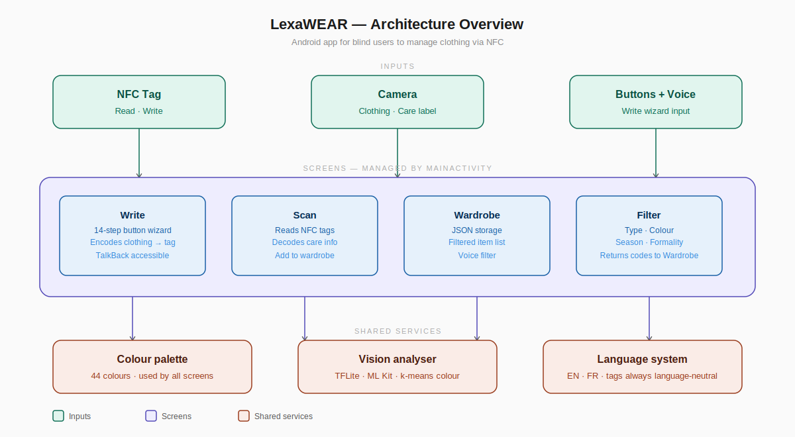
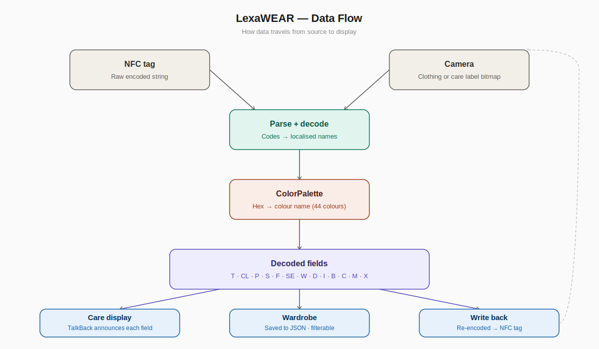
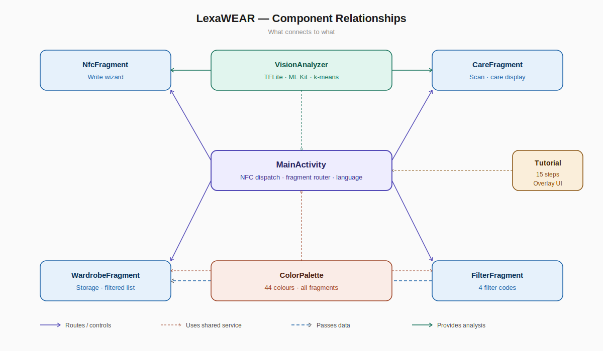

# LexaWEAR — Architecture

## Overview

---

## Data flow

How data travels from an NFC tag or camera scan through to what the user hears via TalkBack.

---

## Component relationships

What connects to what across the app.

